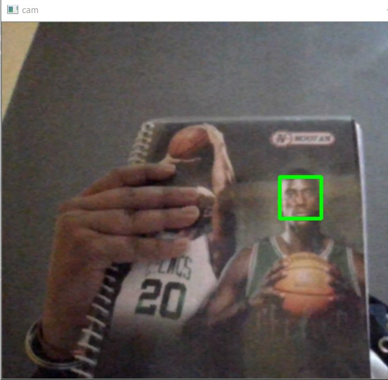

# Face-detection-using-Opencv

A simple face detection through web cam  using Open CV

# Prerequisites
opencv

# INSTALLATION

pip install opencv-python

#Usage 
Just run Detect_face.py python file it will use you PC/Computer webcam to detetct faces 

PRESS ENTER FOR EXIT

You can also detect face from a video by just passing the video location in 5th Line 
LIKE=>

cam=cv2.VideoCapture(VIDEO_LOCATION)

